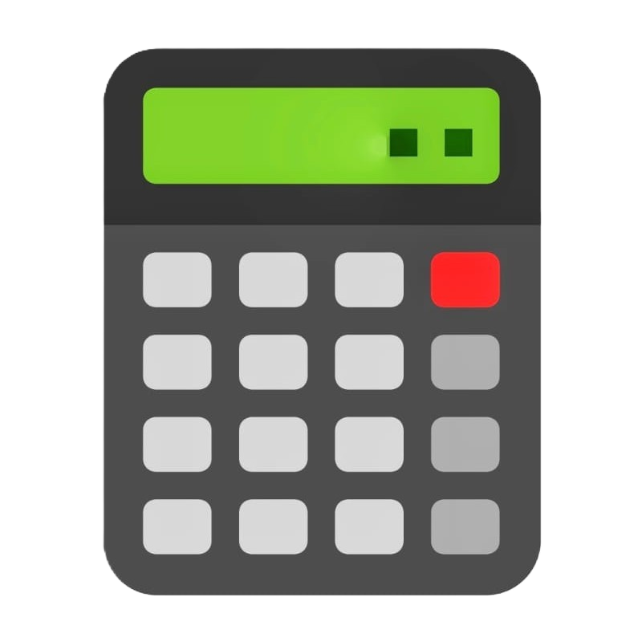
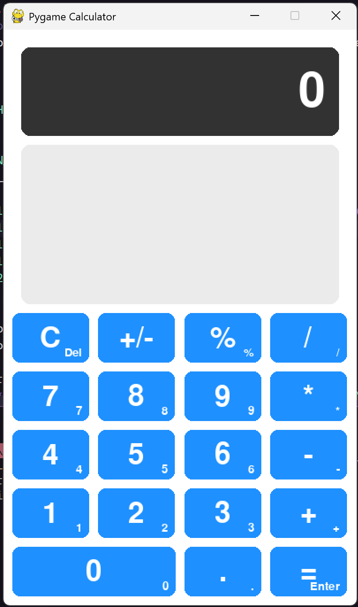

<p align="center">
  
</p>

<h1 align="center"><a href="https://github.com/qtremors/pygame-calculator-app">Pygame Calculator</a></h1>

<p align="center">
  A modern, keyboard-accessible desktop calculator with smooth animations and dark theme
</p>

<p align="center">
  
  
  
</p>

> [!NOTE]
> **Personal Project** 🎯 I built this to explore building performant GUI applications with Pygame-CE and to implement a safe mathematical expression parser from scratch.

---

## ✨ Features

| Feature | Description |
|---------|-------------|
| 🧮 **Standard arithmetic** | Full support for `+`, `-`, `*`, `/`, `%`, and `+/-` toggle. |
| ⌨️ **Keyboard Support** | Fully accessible via standard keyboard and Numpad with intuitive shortcuts. |
| 📜 **Persistent History** | Automatic saving and loading of calculation history for seamless sessions. |
| ✨ **Animated UI** | Smooth hover and press animations with cubic easing and scale effects. |
| 🛡️ **Safe parsing** | Uses the Shunting Yard algorithm for safe expression evaluation without `eval()`. |

---

## 📸 Screenshots

<p align="center">
  
  
</p>

---

## 🚀 Quick Start

```bash
# Clone and navigate
git clone https://github.com/qtremors/pygame-calculator-app.git
cd pygame-calculator-app

# Install dependencies
uv sync

# Run the project
uv run calculator
```

---

## 🛠️ Tech Stack

| Layer | Technology |
|-------|------------|
| **Language** | Python 3.10+ |
| **Graphics** | Pygame-CE |
| **Tooling** | Astral-sh/uv |
| **Testing** | Pytest |

---

## 📁 Project Structure

```
pygame-calculator-app/
├── assets/               # Application icons and screenshots
│   ├── calculator-preview.png
│   ├── home.png
│   └── history.png
├── .github/              # CI/CD workflows
│   └── workflows/
│       └── tests.yml
├── calculator.py         # Main application entry point
├── calculator_engine.py  # Safe expression parsing logic
├── ui_components.py      # Reusable animated UI elements
├── config.py             # Theme and layout configuration
├── DEVELOPMENT.md        # Developer documentation
├── CHANGELOG.md          # Version history
├── LICENSE.md            # License terms
└── README.md
```

---

## 📊 System Resource usage and impact

cpu: < 1% at idle
ram: ~40MB
disk: < 1MB

---

## 🧪 Testing

```bash
# Run all tests
uv run pytest

# Verbose output
uv run pytest -v
```

---

## 📚 Documentation

| Document | Description |
|----------|-------------|
| [DEVELOPMENT.md](DEVELOPMENT.md) | Architecture, engine details, and UI setup |
| [CHANGELOG.md](CHANGELOG.md) | Version history and release notes |
| [LICENSE.md](LICENSE.md) | License terms and attribution |

---

## 📄 License

**Tremors Source License (TSL)** - Source-available license allowing viewing, forking, and derivative works with **mandatory attribution**. Commercial use requires written permission.

See [LICENSE.md](LICENSE.md) for full terms.

---

<p align="center">
  Made with ❤️ by <a href="https://github.com/qtremors">Tremors</a>
</p>