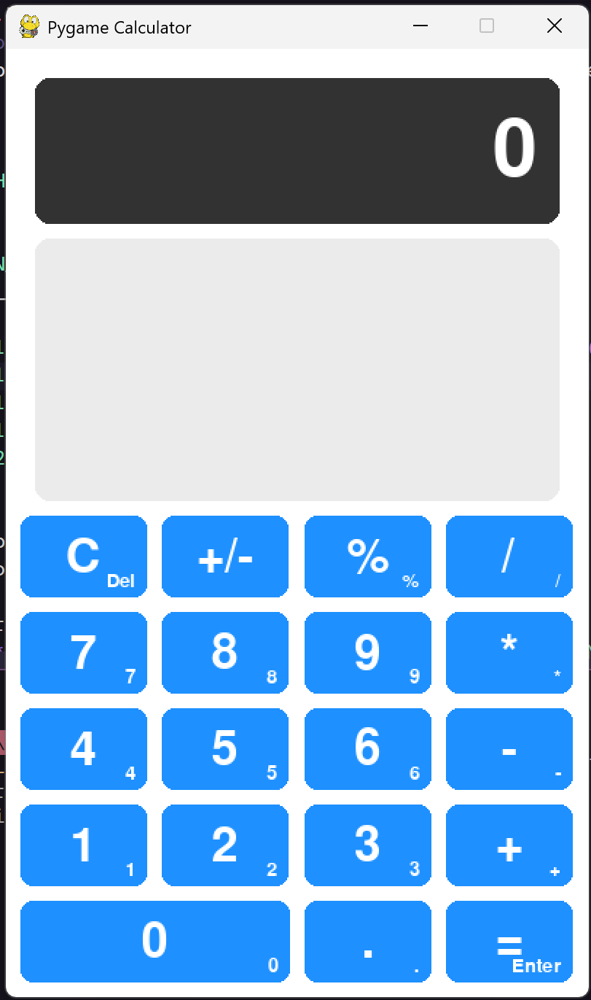
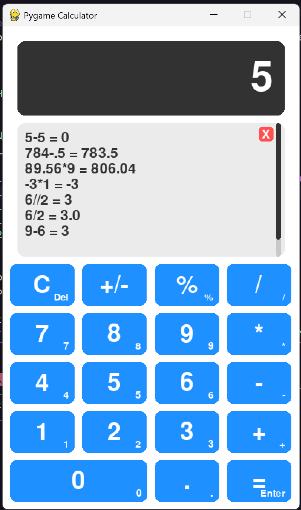

# 📊 Pygame Calculator

A fully functional desktop calculator built with Python and Pygame. This project demonstrates how to create a responsive GUI application with persistent history and full keyboard/mouse support.

---

## 🌐 Overview

Pygame Calculator is a simple yet powerful calculator that supports basic and scientific operations. It features a modern interface, a scrollable calculation history, dynamic font scaling, and full keyboard interaction.

---

## 📸 Screenshots

> Add your screenshots below by replacing the paths.

| Home Screen               | History View                 |
| ------------------------- | ---------------------------- |
|  |  |

---

## ✨ Features

* **Standard & Scientific Operations**

  * Basic arithmetic: `+`, `-`, `*`, `/`
  * Extras: `%` (percentage), `±` (sign toggle)

* **Interactive UI**

  * Clean layout with hover-responsive buttons

* **Persistent History**

  * Saves all calculations to `calculator_history.txt`
  * Reloads history on startup

* **Scrollable History**

  * Mouse wheel support
  * Dynamic scrollbar appears when needed

* **Clear History**

  * Single-click clear option in the history panel

* **Dynamic Font Scaling**

  * Prevents overflow by resizing long inputs

* **Full Keyboard Support**

  * Type inputs directly from keyboard or numpad

* **Error Handling**

  * Graceful messages for invalid operations

---

## 🚀 Getting Started

### Requirements

* Python 3.x
* [Pygame Library](https://www.pygame.org/)

### Installation

```bash
pip install pygame
```

### How to Run

1. Save the script as `pygame_calculator.py`
2. Open terminal/command prompt
3. Navigate to the project directory
4. Run:

```bash
python pygame_calculator.py
```

---

## ⌨️ Controls

| Action                | Mouse                     | Keyboard                  |
| --------------------- | ------------------------- | ------------------------- |
| Input Numbers/Ops     | Click buttons             | 0-9, +, -, \*, /, ., %    |
| Calculate Result      | Click `=` button          | `Enter` or `Keypad Enter` |
| Clear Input           | Click `C` button          | `Delete` or `C` key       |
| Delete Last Character | N/A                       | `Backspace`               |
| Scroll History        | Hover + Mouse Wheel       | N/A                       |
| Clear All History     | Click `X` in history pane | N/A                       |
| Quit Application      | Click window close icon   | `Escape`                  |

---

## 📄 Code Structure

1. **Setup & Initialization**

   * Load Pygame and initialize window, fonts, colors

2. **UI Configuration**

   * Layout: display panel, buttons, history area
   * Built using `pygame.Rect` for element positioning

3. **History Management**

   * Read/write operations with `calculator_history.txt`
   * Clear function and reload on launch

4. **Core Logic**

   * `process_input()` handles calculations and errors

5. **Drawing Functions**

   * `draw_ui()` renders all UI components each frame

6. **Main Loop**

   * Manages events, updates UI, processes input

---

## 📚 About

This project serves as a clean and interactive example of building a desktop GUI app using only Pygame. It’s ideal for learning event loops, custom UI rendering, and user input handling.

Feel free to:

* Add scientific functions
* Apply themes or dark mode
* Enable speech-to-text or sound feedback

---

> Made with Python ♥ by Tremors.
